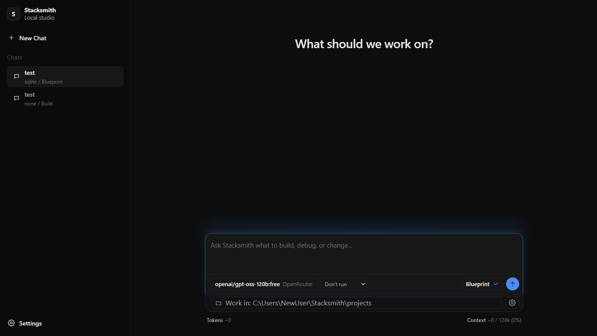

# Stacksmith

**The local AI app studio for builders.**

Build websites, apps, dashboards, tools, and full-stack projects with your own AI, your own database path, and code you actually own.



## ✨ What Is Stacksmith?

Stacksmith is a local-first AI app studio. You run it on your machine, open a browser studio on localhost, connect your preferred AI provider, describe what you want to build, review the plan, and generate a clean local project.

It is inspired by the usefulness of modern AI app builders, but the direction is different:

- 🖥️ **Local-first:** the studio runs on `127.0.0.1`.
- 🔑 **Bring your own model:** Ollama and OpenRouter are supported early.
- 📁 **Own the code:** generated apps are normal local projects.
- 🧭 **Blueprint-first:** review the app plan before generation.
- 🛡️ **Safety-aware:** commands are shown/reviewed, not auto-run in this MVP.
- 🗂️ **Persistent chat history:** local chats restore after restarting Stacksmith.

## 🚦 Current Status

Stacksmith now has an early working local MVP.

Working today:

- CLI command: `stacksmith studio`
- Local browser studio at `http://127.0.0.1:4317`
- Chat-first studio UI
- Persistent local chat history
- Ollama and OpenRouter provider setup
- Model picker in the composer
- Blueprint generation with the selected provider
- Blueprint approval flow
- Direct Build mode for local project generation
- React + Vite + TypeScript generated project template
- No-database and SQLite-ready modes
- Command safety review foundation

Not implemented yet:

- Supabase integration
- Automatic command execution
- Real chat-based code patching after generation
- Production hosting or deployment
- Mobile app generation
- Team/cloud accounts

Stacksmith is still early. Treat generated projects as a starting point, not production-ready output.

## ⚡ Quick Start

Install dependencies:

```bash
npm install
```

Start the local studio:

```bash
npm run dev -- studio
```

Build and run the compiled CLI:

```bash
npm run build
npm start
```

Open:

```text
http://127.0.0.1:4317
```

Health check:

```text
http://127.0.0.1:4317/health
```

Expected response:

```json
{ "ok": true, "phase": "1-shell" }
```

## 🧠 How It Works

The intended flow is:

```text
Prompt → Blueprint → Approve → Generate → Run locally → Edit with chat
```

Current MVP flow:

1. Start the local studio.
2. Create a chat.
3. Choose a provider/model.
4. Pick a database mode and work directory.
5. Generate a blueprint or build directly.
6. Approve the blueprint when using Blueprint mode.
7. Generate a local project.
8. Run the displayed commands manually.

Build mode can generate directly, but Stacksmith still uses an internal structured plan so the generator has a stable shape to work from.

## 🤖 Providers

Early provider support:

- **Ollama:** local models through `http://127.0.0.1:11434`
- **OpenRouter:** cloud models through a user-supplied API key

OpenRouter keys are stored locally using Windows DPAPI in this MVP. Saved keys are never returned to the browser UI.

## 🧱 Generated App Stack

The first generated stack is intentionally focused:

- React
- Vite
- TypeScript
- Small Node/TypeScript API layer
- Shared types
- Optional SQLite-ready structure

One reliable stack is the priority before adding more frameworks.

## 🛡️ Local-Only And Safety

Stacksmith does not host itself, expose public URLs, deploy apps, or run in the cloud.

The local server binds to:

```text
127.0.0.1:4317
```

Command modes:

- **Don't run:** safest default; commands are displayed only.
- **Ask first:** future command execution requires explicit approval.
- **Auto-approve:** future safe-command flow requires command safety review first.

In the current MVP, Stacksmith shows run commands but does not automatically execute generated project commands.

## 🗺️ Roadmap

- ✅ Phase 0: product foundation and docs
- ✅ Phase 1: local studio shell
- ✅ Phase 2: provider-backed blueprint flow
- ✅ Phase 3: first local project generation
- 🚧 Phase 4: better database-aware generation
- 🚧 Phase 5: chat edit/fix loop
- 🔜 Phase 6: Supabase and provider expansion
- 🔜 Phase 7: mobile apps, plugins, and deeper integrations

See [docs/roadmap.md](docs/roadmap.md) for more detail.

## 🧩 What Stacksmith Is Not

- Not a hosted SaaS builder
- Not a deployment platform
- Not a clone of another product
- Not a drag-and-drop website builder
- Not production-ready yet
- Not trying to support every framework in the MVP

## 📚 Docs

- [Vision](docs/vision.md)
- [Product Principles](docs/product-principles.md)
- [MVP Scope](docs/mvp-scope.md)
- [Architecture](docs/architecture.md)
- [Terminology](docs/terminology.md)
- [Roadmap](docs/roadmap.md)
- [Decision Log](docs/decision-log.md)

## 🤝 Contributing

Stacksmith is early and open to focused contributions.

Useful areas:

- Product thinking
- Architecture feedback
- Provider adapters
- Generated app templates
- Database modes
- Safety and command review
- Documentation

Read [CONTRIBUTING.md](CONTRIBUTING.md) before proposing changes.

## 📄 License

MIT. See [LICENSE](LICENSE).
